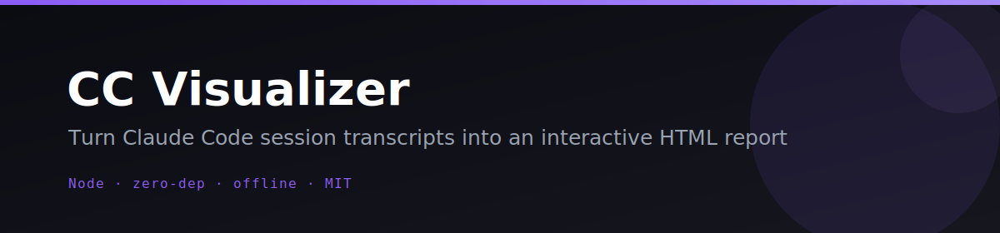
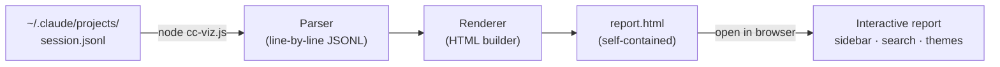

<p align="center"></p>

<p align="center">
  <a href="LICENSE"></a>
  =18">
  
  
  
</p>

# 🔍 CC Visualizer

**Turn Claude Code session transcripts into a polished, interactive HTML report — in one command.**

Claude Code saves every session as a `.jsonl` file full of tool calls, thinking blocks, and assistant turns. CC Visualizer parses that file and emits a single self-contained HTML page with syntax-highlighted diffs, a searchable timeline, per-turn token stats, and dark/light themes — no CDN, no network, no `npm install`.

## ✨ Features

- **Zero dependencies** — pure Node.js stdlib; works on any machine with Node 18+
- **Self-contained output** — one `.html` file, fully offline, no external resources ever
- **Turn minimap sidebar** — jump to any turn instantly by clicking its preview
- **Rich tool renderers** — Bash commands get a `$` prompt, Edit/MultiEdit show before/after diffs, Read shows a file-path badge, Write shows a content preview
- **Syntax-highlighted JSON** — color-coded keys, strings, and numbers for all other tools
- **Collapsible thinking blocks** — purple sections with word counts; redacted blocks are handled gracefully
- **Stats header** — tool-call bar chart, model name(s), session duration, user vs. assistant turn counts, thinking word counts
- **Full-text search** — match count, `n`/`N` navigation, keyboard shortcut `/` to focus
- **Filter chips** — show/hide User, Assistant, Thinking, Tools, or Results turns at a glance
- **Dark + light themes** — toggle persisted in `localStorage`
- **XSS-safe** — all transcript text is HTML-escaped (including `=`, `(`, `)` as numeric entities) before it reaches the page
- **Robust input handling** — malformed or unknown lines are silently skipped; skipped count shown in the report header

## 🎬 How it works



## 🚀 Quickstart

### No install — run directly

```bash
# Clone and visualize the included sample
git clone https://github.com/Alchemist-X/cc-visualizer.git
cd cc-visualizer
node cc-viz.js sample.jsonl        # → writes sample.html
open sample.html                   # macOS; use xdg-open on Linux

# Specify a custom output path
node cc-viz.js sample.jsonl -o /tmp/report.html

# Visualize a real Claude Code session
node cc-viz.js ~/.claude/projects/<project>/<session-id>.jsonl -o out.html

# Run with no arguments → prints usage and lists your local sessions
node cc-viz.js
```

### One-off via npx (no clone needed)

```bash
npx cc-visualizer ~/.claude/projects/<project>/<session-id>.jsonl -o report.html
```

### Global install

```bash
npm install -g cc-visualizer
cc-viz ~/.claude/projects/<project>/<session-id>.jsonl -o out.html
cc-viz --help
```

Requires **Node.js 18+**. No `npm install` needed when running from a clone.

### CLI reference

| Argument / Flag | Description |
|---|---|
| `<transcript.jsonl>` | Input transcript (first positional argument) |
| `-o`, `--output <file>` | Output HTML path — defaults to the input path with `.html` extension |
| `-h`, `--help` | Print usage to stdout and exit `0` |
| _(no arguments)_ | Print usage + list discoverable sessions under `~/.claude/projects`, exit `0` |

### Keyboard shortcuts (in the report)

| Key | Action |
|---|---|
| `/` | Focus search box |
| `n` | Next match |
| `N` | Previous match |
| `Esc` | Clear search |

## ⚙️ Configuration

No configuration file required. The tool is intentionally zero-config for the common case.

**Output path** — controlled by `-o` / `--output`. Defaults to replacing the `.jsonl` extension with `.html` in the same directory.

**Session discovery** — when run with no arguments, CC Visualizer scans `~/.claude/projects` for `.jsonl` files and lists the 30 most recent ones (sorted by modification time). This is a read-only listing; nothing is modified.

**Optional LLM enrichment** — the tool does not currently call any LLM API, but if you extend it (e.g., to add AI summaries), the conventional env vars are:

```bash
export LLM_API_KEY="sk-..."          # OpenAI, Kimi/Moonshot, or any OpenAI-compatible key
export LLM_BASE_URL="https://..."    # e.g. https://api.moonshot.cn/v1
export LLM_MODEL="moonshot-v1-8k"   # model name for the chosen provider
```

## 🧪 Tests & Eval

```bash
# Unit tests (Node built-in runner — no dependencies)
npm test
# or: node --test

# Self-contained pass/fail eval harness
npm run eval
# or: node eval/eval.mjs
```

The unit tests cover JSONL parsing, HTML/XSS escaping, aggregate stats, and empty-input handling. The eval harness checks help/no-arg behavior, self-contained output (no CDN), XSS escaping, malformed-input robustness, 3000-line scale, and packaging — exit `0` only when every criterion passes.

## 🗺️ Roadmap / Needs

CC Visualizer is a working MVP that covers the core use case well. Some directions worth exploring:

- **Watch mode** — auto-regenerate the report as the session grows (`--watch`)
- **Multi-session index** — generate an `index.html` listing all sessions in a project folder
- **Configurable truncation** — `tool_result` blocks are currently capped at 3000 chars; a `--max-result-chars` flag would help large sessions
- **Token cost annotations** — overlay estimated cost next to per-turn token counts
- **Diff improvements** — smarter unified-diff rendering for large `Edit` blocks

Contributions and issues are very welcome.

## 📄 License

MIT © 2026 Alchemist-X

---

<p align="center">If CC Visualizer saves you time, consider giving it a star. ⭐</p>
